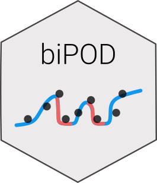

<!-- README.md is generated from README.Rmd. Please edit that file -->

```{r, include = FALSE}
knitr::opts_chunk$set(
  collapse = TRUE,
  comment = "#>",
  fig.path = "man/figures/README-",
  out.width = "100%"
)
```

# biPOD <a href="caravagnalab.github.io/biPOD"></a>

<!-- badges: start -->
[](https://github.com/caravagnalab/biPOD/actions)
[](https://github.com/caravagnalab/biPOD/actions/workflows/pkgdown.yaml)
[](https://github.com/caravagnalab/biPOD/actions/workflows/R-CMD-check.yaml)
[](https://app.codecov.io/gh/caravagnalab/biPOD?branch=main)
<!-- badges: end -->

biPOD is a package to infer kinetic parameters of an evolving population whose size is observed at discrete intervals of time. The tool is able to ...

#### Help and support

[](https://caravagnalab.github.io/biPOD)
-----

## Installation

``` r
# install.packages("devtools")
devtools::install_github("caravagnalab/biPOD")
```

-----

#### Copyright and contacts

Cancer Data Science (CDS) Laboratory, University of Trieste, Italy.

[](https://github.com/caravagnalab)
[](https://www.caravagnalab.org/)
