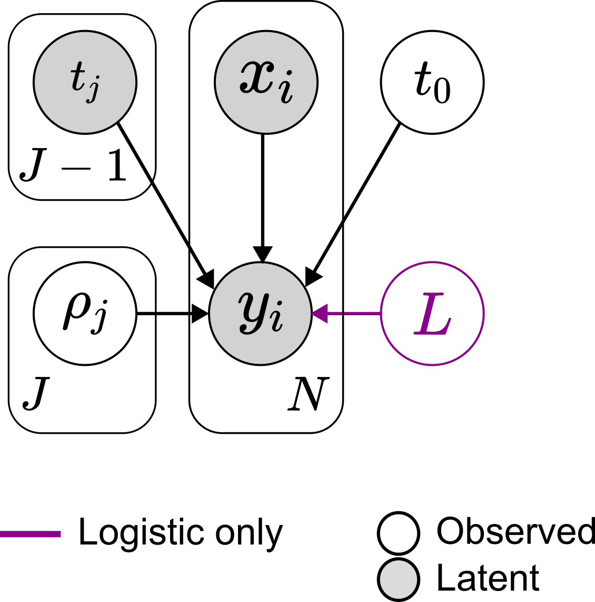
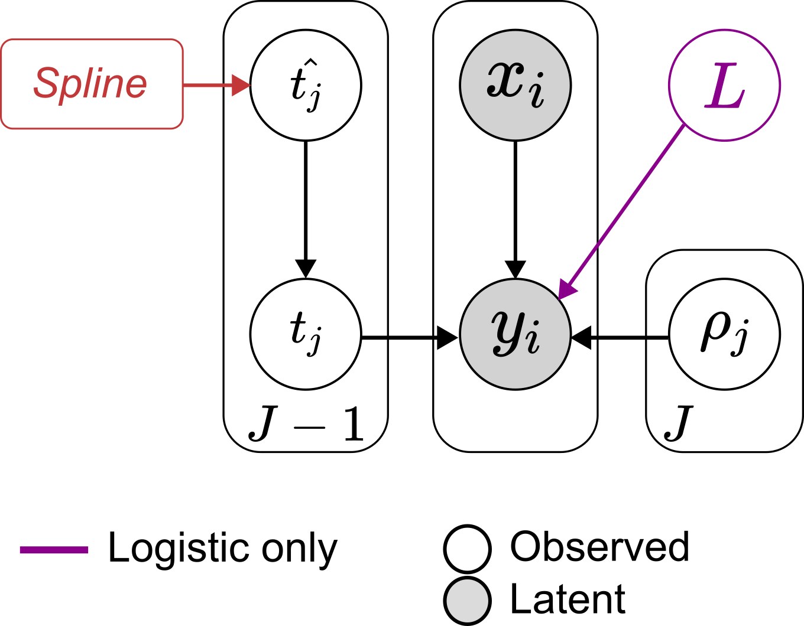
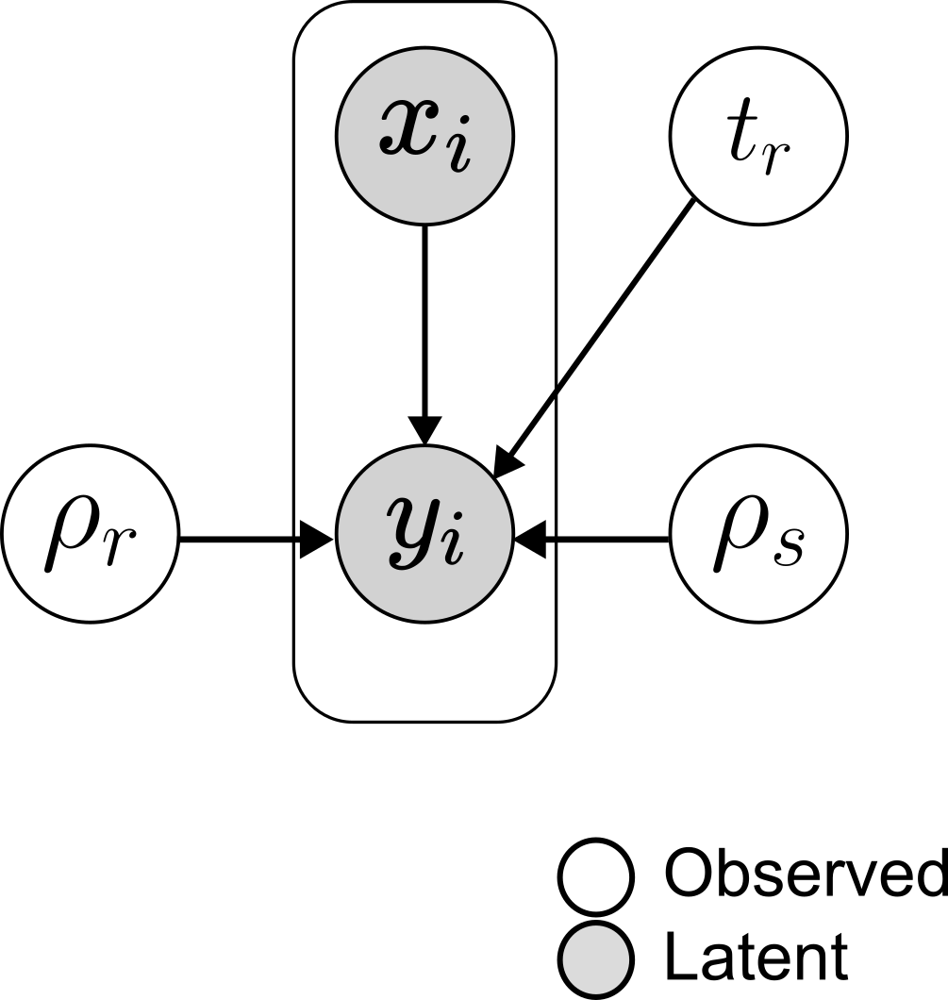

```{r, include = FALSE}
knitr::opts_chunk$set(
  collapse = TRUE,
  comment = "#>"
)
```

## Methods

### Multi-step logistic and exponential growth models

A general growth process can be seen as a continuous-time Markov process [8,11], where $y(x) \in \mathbb{N}_0$  represents the number of individuals in the population of cancerous cell at time $t$, and $t_0$ indicates the instant of time in which the first cancerous cell is born, i.e. $y(x=t_0)=1$.
The transition rates for such problem are defined as:

\begin{align*}
    \alpha_n(x) = \lim_{h \rightarrow 0^+} \frac{1}{h} P[y(x+h) = n+1 \mid y(x)=n]\\
    \beta_n(x) = \lim_{h \rightarrow 0^+} \frac{1}{h} P[y(x+h) = n-1 \mid y(x)=n]
\end{align*}

Where $\alpha_n(t)$ and $\beta_n(t)$ are both positive functions and indicates the birth and death rates of the population when $y(x)=n$. Similarly, one can denote with $\alpha(t)$ and with $\beta(t)$ the individual birth and death rate at time $t$.
Assuming that $y(0)=n_0$ with $n_0 \in \mathbb{N}$ and given $m \in \mathbb{N}_0$, one is interested in computing

\begin{align*}
    P_{n_0,m}(x) = P[y(x)=m \mid y(0)=n_0], \quad t \geq 0
\end{align*}

which represents the probability that the population reaches a population size equal to $m$ at time $x$ conditioned on the population size at $x=0$. Quite trivially, $P_0m=0 \hspace{1mm} \forall m>0$, meaning that 0 is an absorbing state for the Markov process. The probability generating function for this process is

\begin{align*}
    G(z,x) = \sum_{m=0}^{\infty} P_{n_0m}(x)z^m
\end{align*}

and, as shown in [12], can be rewritten as

\begin{align*}
    G(z,x) = [1-(z-1)[(z-1)\phi(x)-\psi(x)]^{-1}]^{n_0}
\end{align*}

where the quantities $\phi(x)$ and $\psi(x)$ depends on the functional form of the individuals birth and death rates:

\begin{align*}
    \psi(x) = \exp \left\{ -\int_0^x (\alpha(\tau) - \beta(\tau)) d\tau \right\} \\
    \phi(x) = \int_0^x \alpha(\tau) \psi(\tau) d\tau
\end{align*}

Hence, it is possible to easily compute the expectation and the variance of $y(x)$:

\begin{align*}
    \mathbb{E}_{n_0}(x) = \mathbb{E}[y(x) \mid n_0] = \frac{n_0}{\psi(x)} \\
    \text{Var}_{n_0}(x) = n_0 \frac{\psi(x) + 2\phi(x)-1}{\psi^2(x)}
\end{align*}

### Exponential growth

The first growth pattern we consider can be expressed through a simple yet ubiquitous differential equation:

\begin{align*}
    \frac{dy(x)}{dx} = \rho y(x)
\end{align*}

where $\rho \geq 0$ represents the growth rate. The solution of the aforementioned equation yields

\begin{align*}
    y(x) = n_0e^{\rho x}
\end{align*}

indicating that a population starting from $n_0$ will evolve exponentially over time with no upper bounds. In such growth pattern, the transition rates can be written as

\begin{align*}
    \alpha_n=y\alpha(x) \quad \beta_n=y\beta(x)
\end{align*}

It’s natural to observe that the birth and death rates are linear with respect to $n$, meaning that the probability of a birth (or death) happening in an infinitesimal time-interval is proportional to the previous size of the population. Let $\rho(x) = \alpha(x) - \beta(x)$ be the individual net growth rate at time $x$ and assume that $\rho(x)$ is a piece-wise constant function, representing different net growth rates for a multi-step growth process. Without loss of generality, consider a process with a single known time-point $t_1$ in which the net growth rate changes from $\rho_0$ to $\rho_1$; in such case the form of $\psi(x)$ will be

\begin{align*}
    \phi(x) = \exp \left\{ -\rho_0 x\right\}, \quad x \leq t_1 \\
    \phi(x) = \exp \left\{ -\rho_0 t_1\right\} \exp \left\{ -\rho_1 (x-t_1)\right\}, \quad x > t_1
\end{align*}

It’s trivial to see that this can be generalised to any number of time-points, i.e. to any number of different growth rates, and that the expected mean conditioned on $n_0$ can be computed as

\begin{align*}
    \mathbb{E}_{n_0}(x) = n_0 \exp \left\{ \rho_0 x\right\}, \quad x \leq t_1 \\
    \mathbb{E}_{n_0}(x) = n_0 \exp \left\{ \rho_0 t_1\right\} \exp \left\{ \rho_1 (x-t_1)\right\}, \quad x \leq t_1
\end{align*}

### Logistic growth

The logistic model is a generalisation of the exponential one which takes into account the possibility that the maximum population size is constrained. In this case we define the carrying capacity $L$ as such upper bound, which can be caused by many environmental factors such as the availability of resources or space. The generalised differential equation becomes

\begin{align*}
    \frac{dy(x)}{dx} = \rho \left[ 1 - \frac{y(x)}{L} y(x) \right]
\end{align*}

The second term modulates the effective growth rate affecting the population: a bigger population size leads to a slower growth. By letting $L \rightarrow \infty$, the logistic equation tends to the exponential one. The equation can easily be solved by separation of variables and which yields as solution

\begin{align*}
    y(x) = \frac{n_0L}{n_0 + (L - n_0) \exp\{-\rho x\}}
\end{align*}

One can also merge the two terms of the differential equation and substitute them with a time-dependent growth rate:
\begin{align*}
    \frac{dy(x)}{dx} = \nu(x) y(x)
\end{align*}

In this case, the solution for $\nu (t)$ is straightforward:

\begin{align*}
    \nu(x) = \frac{\rho (L - n_0)}{(L-n_0) + n_0 \exp \{ \rho x \}}
\end{align*}

Now, similarly as what has been done in the exponential case where  indicated the net growth rate per capita and was defined as a piece-wise constant function, $\nu (x)$ once again represents the net growth rate per capita which depends on the initial conditions, the carrying capacity $L$ and the functional form of $\rho$. Once again, we assume $\rho$ to be piece-wise constant and we denote as ti its changing points. Hence, we are modelling growth patterns in which the net growth rate  changes over the time not only depending on the population size, but also on the value of the piece-wise constant function $\rho(t)$. 
Now, without loss of generality let’s consider a single changing point $t_1$ so that one can first compute $\psi(x)$ and the the expected mean conditioned on the starting conditions (i.e. the value of $n_0$)

\begin{align*}
    \mathbb{E}_{n_0}(x) = \frac{n_0L}{n_0 + (L - n_0) \exp\{-\rho_0 x\}}, \quad x \leq t_1 \\
    \mathbb{E}_{n_0}(x) = \frac{n_1L}{n_1 + (L - n_1) \exp\{-\rho_1 (x-t_1)\}}, \quad x > t_1
\end{align*}

where we define $n_1$ as $\mathbb{E}_{n_0}(x=t_1)$.

### Start of the process

We discussed so far the situation in which $y(0)=n_0$ since the most common situation is that the first observation of a growth process happens much later than the actual start of the process. Nonetheless, one could also be interested in obtaining an estimate, or at least an upper bound, for $t_0 = \min\{x \mid y(x)=1\}$. This can be done by simply shifting by $t_0$ the values of all the instant of times (i.e. with the change of variables $x'=x-t_0$). The only modification to the model is that now $y(x'=0)=1$.

### Population dynamics change-points detection

In general, the change-points $t_i$ defining the intervals of time of the piece-wise functions that we consider might not be known and, therefore, a method to infer them is needed. The main assumption we make is that the underlying growth rates do change sign at the breakpoints. In other words, at a given change point, the population should change its status from “growing” to “shrinking” or viceversa. 
It follows that the change-points will be found at the locations in which the true function $y(x)$ describing the process will present either a minimum or a maximum, or, equivalently, in which the first derivative $y'(x)$ will be zero. 
Given the intrinsic noise present in the observations, a point might look like a maximum/minimum of the function without actually being one. Because of this, we make use of a spline approximation to smooth out the noise and to propose a set of candidates change-points $\hat{t_i}$ which will be used as priors during the inference of the breakpoints.

The cubic spline estimate $\hat{y}$ is the function that minimize [13]

\begin{align*}
    \frac{1}{n}\sum_{j=1}^n \left[ \hat{y}(x_n) - y_n)\right]^2 + \lambda \int \hat{y}''(x)^2 dx
\end{align*}

where $\lambda$ is a smoothing parameter that controls the trade-off between the “fitness” (first term) and the “roughness” (second term) of the approximation. It’s easy to notice that $\lambda = 0$ produces the interpolating splines whereas $\lambda \rightarrow \infty$ produces a linear least squares estimate. 
Once the approximation $\hat{y}$ is obtained, one can easily compute the points in which its first derivative changes sign. We denote those points as $\hat{t_i}$. 
Obviously, the choice of $\lambda$ affects the multiplicity of the minima/maxima that will be found. Therefore, $\lambda$ can either be user-defined or can be tuned in order to obtain a user-defined number of change-points.
Once the set of $\hat{t_i}$ have been found, we define a prior over them. For each $i$ we choose a truncated normal distribution with the following characteristics: 

\begin{itemize}
    \item mean equal to $\hat{t_i}$
    \item variance equal to $\sigma_t$, user-defined
    \item the distribution is defined over the interval $\delta_i = (t_i-\sigma_t,t_i + \sigma_t)$
\end{itemize}

Moreover, the prior distributions are constrained by the fact that the inferred change-points should be in increasing order and therefore we enforce that their intervals do not overlap. Hence, considering $\Delta t_i=t_i-t_{i-1}$, $\sigma_t$ might change according to

\begin{align*}
    \sigma_t = \min \{ \sigma_t, \min \{ \frac{1}{2}\Delta t_i \} \}
\end{align*}

Then, the inference is carried out in order to obtain posterior distributions for the change points and the medians of such posteriors can be used as “true” change points for the first task. 

### Nested growth models for competing populations

A typical scenario is the one in which a tumor is treated, its mass shrinks and it later regrows. In this case, the observed dynamics is U-shaped. For such cases, we assume the presence of two populations $s$ and $r$; the first is sensitive to the treatment, whereas the second one is resistant to it. This means that a positive and a negative growth rates will be exhibited by the two populations, respectively.

The sensitive population is assumed to be present at the start of treatment with the initial condition $y_s(x=0)=n_s$ and is governed by the differential equation

\begin{align*}
    \frac{dy_s(x)}{dx} = -\rho_s (x)
\end{align*}

For the second population is assumed that the first resistant cell is born at $x=t_r$. Therefore, the differential equation governing the dynamics of the resistant population will be

\begin{align*}
  \frac{dy_r(x)}{dx} = u(x - t_r) \rho_r y_r
\end{align*}

where the Heaviside function $u(x-t_r)$ is defined as 

\begin{equation}
  u(x-t_r) = 
   \left\{\begin{array}{lr}
       0, &  x \le t_r \\
       1, &  x > t_r
    \end{array}\right.
\end{equation}


Trivially, the observed counts $y(x)$ will be the sum of the two populations and can be obtained analytically by integrating the two equations above and summing them. For $x \ge 0$ this gives:

\begin{align*}
    y(x) = n_s \exp\{-\rho_s x\} + u(x - t_r) \exp\{\rho_r (x - t_r)\}
\end{align*}

### Likelihood compuation

For all the presented models and for a given set of observations $X =\{(x_n, y_n\)}$ we consider each of them as drawn from a poisson process with parameter equal to the expected value of the population $\mathbb{E}_y(x)$ where the analytical form of the expected value will depend on the considered task. This means that for a given task with parameters $\theta$, the likelihood will be computed as:

\begin{align*}
\mathbb{L}(X \mid \theta) = \prod_{n=1}^{|X|} \text{Poisson}(y_n \mid \mathbb{E}[ y(x_n) \mid \theta])
\end{align*}

## Models' PGMs

The probabilistic graphical models for the tree different task will be presented and the prior distributions employed in each of them will be described in detail.

### Task 1

<center>

</center>

Given the trajectory $X =\{(x_n, y_n\)}$ of a population divided in $J$ time windows, the parameters of interest will be the $J$ growth rates $\rho_j$, the instant of time $t_0$ in which the population was born and, if the population is undergoing a logistic growth, the carrying capacity $L$.

The priors for those values are:

\begin{gathered}
    \rho_j \sim \text{Normal}(0,1) \\
    t_0 \sim \text{TruncatedNormal}(x_1, 100, -\infty, x_1) \\
    L \sim \text{TruncatedNormal}(\text{max}(x_n), \text{max}(x_n), \text{max}(x_n), \infty)
\end{gathered}

We choose a standard normal for the growth rates, a broad normal for $t_0$ with the constraint that $t_0$ must be smaller or equal to the time of the first observation, and a broad normal for the carrying capacity with the constraint that $L$ must be greater or equal to the largest observation.

### Task 2

<center>

</center>

Given the trajectory $X =\{(x_n, y_n\)}$ of a population, the parameters of interest will be the $J-1$ change points, where $J-1$ is either given by the user or is the results of the choice of the $\lambda$ parameter in the spline approximation.

The priors for those values are:

\begin{gathered}
    t_j \sim \text{TruncatedNormal}(\hat{t_j},\sigma_t, \hat{t_j} - \sigma_t, \hat{t_j} + \sigma_t) \\
\end{gathered}

Essentially, for each $\hat{t_j}$ proposed by the spline approximation we choose a flat normal distribution constrained in the interval $[\hat{t_j}-\sigma_t, \hat{t_j} + \sigma_t]$.

### Task 3

<center>

</center>

Given the trajectory $X =\{(x_n, y_n\)}$ where a resistant and a sensitive population are assumed to co-exist, the parameters of interest will the two growth rates $\rho_s$ and $\rho_r$, the size of the sensitive population $n_s$ at the instant of time of the first observation and the instant of time in which the resistant population is born $t_r$. 

The priors for those values are:

\begin{gathered}
    \rho_s \sim \text{HalfNormal}(0,1) \\
    \rho_r \sim \text{HalfNormal}(0,1) \\
    n_s \sim \text{TruncatedNormal}(\frac{y_1}{2}, y_1, 1, 1.1 y_1) \\
    t_r \sim \text{Normal}(x_1, 100)
\end{gathered}

Essentially, we choose a standard normal distribution for the two growth rates, a very broad normal for $n_s$ with the constraint that if at the beginning the resistant population is not born yet, the maximum error we are committing is 10\%, and a very flat normal distribution centered on the beginning of the process for $t_r$.
